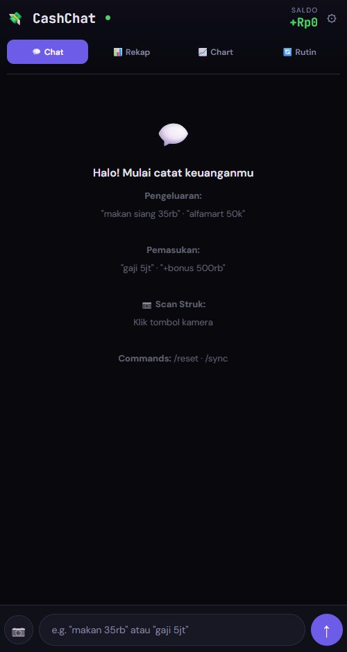
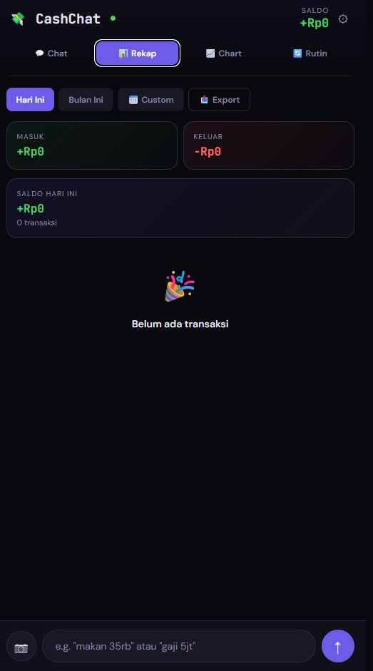

# 💸 CashChat — Expense & Income Tracker

CashChat adalah aplikasi pencatat keuangan berbasis chat yang berjalan sepenuhnya di browser. Tidak perlu install, tidak perlu akun, cukup buka file HTML-nya. Data tersimpan di Google Sheets milikmu sendiri.

---


## 📱 Tampilan Aplikasi

<p align="center">
  
  &nbsp;&nbsp;&nbsp;
  
</p>
<p align="center">
  <em>Kiri: Tab Chat — input pengeluaran/pemasukan via teks natural &nbsp;|&nbsp; Kanan: Tab Rekap — ringkasan harian/bulanan</em>
</p>

---

## ✨ Fitur Utama

- **Chat-based input** — catat pengeluaran dan pemasukan dengan bahasa natural seperti ngetik di WhatsApp
- **Auto-parsing** — otomatis deteksi jumlah, kategori, dan lokasi dari teks bebas
- **Koreksi typo & singkatan** — `mjn` → `makan`, `mlm` → `malam`, dll
- **Scan struk** — foto struk belanja, otomatis di-extract pakai Gemini AI
- **Rekap & chart** — ringkasan harian/bulanan dengan visualisasi bar chart
- **Tagihan rutin** — catat tagihan bulanan yang otomatis tercatat tiap bulan
- **Sync Google Sheets** — semua data tersimpan di Google Sheet milikmu sendiri
- **Offline-first** — tetap bisa dipakai walau tidak ada internet (data lokal via localStorage)

---

## 🗂️ Struktur File

```
cashchat.html   → Aplikasi utama (satu file, langsung buka di browser)
Code.gs         → Google Apps Script untuk backend Google Sheets
```

---

## 🚀 Cara Setup

Ada dua bagian yang perlu disiapkan: **Google Sheets** (tempat penyimpanan data) dan **Apps Script** (jembatan antara CashChat dengan Sheets).

### Bagian 1 — Google Sheets & Apps Script

#### Langkah 1: Buat Google Sheet baru

1. Buka [sheets.google.com](https://sheets.google.com)
2. Klik **+ Blank** untuk buat spreadsheet baru
3. Beri nama sesuai selera, misalnya `CashChat Data`
4. Buat header di baris pertama dengan kolom berikut (isi di baris 1, kolom A sampai G):

   | A | B | C | D | E | F | G |
   |---|---|---|---|---|---|---|
   | id | date | description | category | amount | type | store |

#### Langkah 2: Buka Apps Script

1. Di Google Sheet, klik menu **Extensions → Apps Script**
2. Akan terbuka tab baru dengan editor script
3. Hapus semua kode yang ada di sana (biasanya ada fungsi `myFunction` kosong)

#### Langkah 3: Paste kode Code.gs

1. Copy seluruh isi file `Code.gs`
2. Paste ke editor Apps Script
3. Klik ikon **💾 Save** (atau `Ctrl+S`)
4. Beri nama project jika diminta, misalnya `CashChat`

#### Langkah 4: Deploy sebagai Web App

1. Klik tombol **Deploy** (pojok kanan atas) → pilih **New deployment**
2. Klik ikon ⚙️ di samping "Select type" → pilih **Web app**
3. Isi konfigurasi:
   - **Description**: `CashChat API` (bebas)
   - **Execute as**: `Me` (pakai akun Google kamu)
   - **Who has access**: `Anyone` ← **penting**, ini yang memungkinkan CashChat konek ke script
4. Klik **Deploy**
5. Klik **Authorize access** → pilih akun Google kamu → klik **Allow**
6. Setelah selesai, akan muncul **Web app URL** — copy URL ini, akan dipakai di langkah selanjutnya

> ⚠️ **Catatan keamanan**: URL Apps Script ini berfungsi seperti API key. Jaga jangan sampai dibagikan ke orang lain, karena siapapun yang punya URL ini bisa membaca dan menulis data di Sheet kamu.

---

### Bagian 2 — Setup CashChat

1. Buka file `cashchat.html` di browser (double-click atau drag ke browser)
2. Klik ikon **⚙️** di pojok kanan atas
3. Paste **Web app URL** dari Apps Script ke kolom **Google Apps Script URL**
4. Klik **💾 Simpan**
5. Aplikasi akan langsung sync dengan Google Sheet kamu

---

## 📷 Setup Scan Struk (Gemini API)

Fitur scan struk menggunakan **Google Gemini AI** untuk membaca foto struk belanja dan mengekstrak item beserta harganya secara otomatis.

### Cara Dapat Gemini API Key (Gratis)

1. Buka [aistudio.google.com](https://aistudio.google.com)
2. Login dengan akun Google
3. Klik **Get API Key** di sidebar kiri
4. Klik **Create API Key**
5. Pilih project Google Cloud (buat baru jika belum ada)
6. Copy API key yang muncul

### Cara Setup di CashChat

1. Klik ikon **⚙️** di CashChat
2. Paste API key ke kolom **Gemini API Key**
3. Klik **💾 Simpan**

### Cara Pakai Scan Struk

1. Klik tombol **📷** di input bar
2. Pilih foto struk dari galeri atau ambil foto langsung
3. Tunggu beberapa detik — Gemini akan membaca struk
4. Semua item dan harganya otomatis tercatat

### Catatan Gemini API

- **Gratis**: Google AI Studio memberikan kuota gratis yang cukup untuk pemakaian personal (per April 2025: 1.500 request/hari untuk Gemini 2.5 Flash)
- **Model yang dipakai**: `gemini-2.5-flash` — model tercepat dan paling hemat dari Google
- **Data struk**: gambar dikirim ke server Google untuk diproses, tidak disimpan permanen
- **Akurasi**: tergantung kualitas foto. Foto yang terang, tidak blur, dan tidak terpotong akan memberikan hasil terbaik

---

## 💬 Cara Input via Chat

CashChat memahami bahasa natural. Beberapa contoh:

### Pengeluaran
```
makan siang 35rb
makan malam di BIP 350rb
makan malam Mall Bintaro Exchange 750rb
kopi starbucks 65000
ojek 25rb
bayar listrik 450rb
belanja alfamart 120k
nonton CGV 2 tiket 100rb
```

### Pemasukan
```
gaji 8jt
+freelance desain 500rb
+transfer masuk 200rb
bonus bulanan 1jt
```

### Singkatan yang didukung
| Singkatan | Artinya |
|-----------|---------|
| `mjn` | makan |
| `mkn` | makan |
| `mlm` | malam |
| `pg` | pagi |
| `sng` | siang |
| `sor` | sore |
| `blnj` | belanja |
| `ojl` | ojol |

### Format Angka yang Didukung
| Format | Nilai |
|--------|-------|
| `35rb` | Rp35.000 |
| `35ribu` | Rp35.000 |
| `35k` | Rp35.000 |
| `5jt` | Rp5.000.000 |
| `5juta` | Rp5.000.000 |
| `35000` | Rp35.000 |
| `Rp35.000` | Rp35.000 |

---

## 🏷️ Kategori Otomatis

CashChat otomatis mendeteksi kategori berdasarkan kata kunci:

| Kategori | Contoh Kata Kunci |
|----------|-------------------|
| 🍔 Makan | makan, nasi, ayam, resto, warteg, mcd, kfc |
| ☕ Ngopi & Minum | kopi, starbucks, boba, chatime, kenangan |
| 🛒 Groceries | alfamart, indomaret, supermarket, belanja bulanan |
| 🚗 Transport | grab, gojek, ojek, bensin, parkir, tol, krl |
| 🛍️ Belanja | baju, sepatu, tokopedia, shopee, mall |
| 🏠 Rumah & Tagihan | listrik, wifi, pulsa, sewa, kos, bpjs |
| 🎮 Hiburan | netflix, spotify, nonton, bioskop, game |
| 💊 Kesehatan | obat, dokter, apotek, vitamin |
| 💰 Gaji | gaji, salary, payroll |
| 💼 Freelance | freelance, project, jasa, fee |

---

## ⌨️ Commands Khusus

| Command | Fungsi |
|---------|--------|
| `/reset` | Hapus semua riwayat chat di perangkat (data di Sheet tetap aman) |
| `/sync` | Paksa sinkronisasi ulang data dari Google Sheet |

---

## 🔒 Privasi & Keamanan

- **Google Sheet kamu private** — tidak bisa diakses siapapun kecuali kamu sebagai pemilik
- **Apps Script URL adalah "kunci" akses** — jaga kerahasiaannya, jangan dibagikan
- **Tidak ada server pihak ketiga** — CashChat langsung konek ke Google Sheet dan Gemini API milikmu
- **Data lokal** — riwayat chat juga disimpan di `localStorage` browser, tidak dikirim ke mana-mana
- **Setiap pengguna punya setup sendiri** — tidak ada database bersama

---

## 🛠️ Troubleshooting

**Sync dot merah (●), data tidak tersimpan ke Sheet**
- Pastikan Apps Script URL sudah benar di Settings
- Coba deploy ulang Apps Script dan gunakan URL yang baru
- Pastikan saat deploy, "Who has access" diset ke `Anyone`

**Scan struk tidak bekerja**
- Pastikan Gemini API Key sudah diisi di Settings
- Cek apakah API key masih aktif di [aistudio.google.com](https://aistudio.google.com)
- Coba foto struk lebih terang dan tidak blur

**Jumlah tidak terdeteksi**
- Pastikan ada angka yang jelas di pesan, misal `35rb`, `50k`, atau `200000`
- Hindari format seperti `35.000` (titik bisa terbaca ambigu) — lebih aman pakai `35rb` atau `35000`

**Data di Sheet tidak muncul di app**
- Klik `/sync` di chat untuk force refresh
- Pastikan header di baris 1 Sheet sudah benar: `id, date, description, category, amount, type, store`
